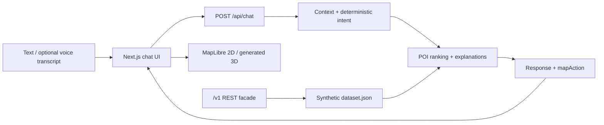

# TASCO Atlas

**A privacy-first conversational AI map for Vietnamese discovery — with a 2D map for utility and a generated 3D Route Theater for the wow moment.**

TASCO Atlas turns requests such as _“Tôi có 90 phút ở Quận 1: cà phê yên tĩnh rồi ăn tối có view”_ into explainable place recommendations and structured map actions. It supports multi-turn context, clarification, synthetic user profiles, optional Vietnamese voice input, and a camera-free 3D presentation mode.

This is a hackathon prototype built from the supplied TASCO problem statement, API document, and evaluation workbook. It does **not** use live TASCO/VETC customer data, production routing, real building models, or a camera feed.

## Why this prototype

The challenge asks for natural conversations rather than another keyword box. The practical constraint is equally important: a camera-first concept raises privacy, data-availability, and approval risk, while the repository contains no images or 3D building assets.

TASCO Atlas keeps the useful core and moves the wow factor to the map:

- Vietnamese conversational discovery with reasons, confidence, and map actions.
- Explicit clarification instead of guessing ambiguous places such as “Galaxy.”
- Deterministic personalization from synthetic profiles and POI metadata.
- A single MapLibre canvas that switches between 2D and generated 3D.
- **3D AI Route Theater:** recommendations become a sequential spatial story.
- No API key, database, account, or camera required for the demo.

## Demo in 90 seconds

1. Open the app and choose a synthetic context profile.
2. Send: **“Tôi có 90 phút ở Quận 1: cà phê yên tĩnh rồi ăn tối có view.”**
3. Show the ranked cards, reasons, confidence, and markers updating together.
4. Press **3D AI Route Theater** to pitch the map, extrude popularity towers, draw the presentation route, and fly between stops.
5. Send: **“Đưa tôi đến Galaxy.”** Show that Atlas asks which Galaxy rather than inventing a destination.
6. Use the microphone button for a Vietnamese voice-like query, review its transcript, then submit.
7. Open **Camera-free demo** to show the synthetic-data and session-only privacy boundary.

> Demo honesty: Route Theater is a visualization of recommendation order, not road-accurate navigation. The `/v1/route` endpoint also returns deterministic simulated geometry, clearly described below.

## Run locally

Prerequisites:

- Node.js 20.9 or newer
- pnpm (Corepack is fine)
- A modern browser with WebGL; microphone input is optional

```bash
corepack enable
pnpm install
pnpm dev
```

Open [http://localhost:3000](http://localhost:3000).

No `.env` file or model API key is required. The OpenStreetMap raster base layer needs network access; if tile loading fails, the app labels the base layer as offline while the committed TASCO demo data and deterministic APIs remain available.

### Project scripts

| Command | Purpose |
| --- | --- |
| `pnpm dev` | Start the Next.js development server with Turbopack |
| `pnpm build` | Create a production build |
| `pnpm start` | Run the production build |
| `pnpm lint` | Run ESLint across the repository |
| `pnpm typecheck` | Run TypeScript without emitting files |
| `pnpm test` | Run the Vitest suite once |
| `pnpm test:watch` | Run Vitest in watch mode |

## Product capabilities

### Conversation and context

`POST /api/chat` returns both natural Vietnamese text and a stable structured payload. Representative shape (wording and values are illustrative):

```json
{
  "intent": "recommendation",
  "assistantResponse": "Tôi tìm được các lựa chọn phù hợp nhất và kèm lý do để bạn kiểm tra.",
  "recommendations": [
    {
      "poi": { "id": "POI005", "name": "Rooftop Chill Skybar" },
      "score": 0.91,
      "reason": "Khớp hẹn hò, view đẹp và vị trí Quận 1.",
      "scoreBreakdown": { "categoryMatch": 0.2, "locationMatch": 0.13 }
    }
  ],
  "confidence": 0.91,
  "mapAction": { "type": "search", "poiIds": ["POI005"] },
  "privacy": { "mode": "session-only", "persisted": false }
}
```

The exact wording and scores depend on the query. Clients can pass `history` and the returned `sessionContext` into the next request. Ambiguous entities produce a `clarify` action with candidates rather than a forced recommendation.

### Recommendation engine

The current engine is deterministic. It normalizes Vietnamese text and aliases, infers categories and locations, applies profile preferences/avoidances and budget compatibility, computes Haversine proximity when coordinates are provided, and blends those signals with rating/popularity. Each result includes a reason and weighted `scoreBreakdown`; ties are stable.

OpenAI is optional and limited to rewriting already-grounded Vietnamese prose. The deterministic pipeline remains authoritative for intent, POI ranking, map actions, Journey Checkout actions, prices, totals, and revisions; it is also the automatic fallback when no key is configured or the provider fails.

### Journey Checkout

An eligible Vietnamese driving request naming at least two of fuel, dining, and parking produces one `journey` with 2–3 dataset-grounded actions. Stable action IDs, integer VND prices, discounts, rewards, totals, sponsorship disclosures, and `simulated: true` markers are computed locally. `Rẻ hơn một chút` reuses compact client-carried journey state and either returns a strictly lower same-category/same-city bundle or honestly retains the current journey. Confirmation and its single simulated VETC receipt are browser-local and hand off to the existing Route Theater.

The exact scoring formula and context lifecycle are documented in [docs/architecture.md](docs/architecture.md).

### 2D map

- Category-colored POI markers and selected-place details
- Recommendation-driven viewport updates
- Gradient route visualization
- OpenStreetMap raster base tiles with visible attribution

### Generated 3D map

3D mode stays on the same MapLibre canvas. It changes pitch and bearing, then renders generated square `fill-extrusion` towers whose height reflects the synthetic POI `popularityScore`. These towers are visual encodings, **not** real building footprints, heights, or Three.js models.

Route Theater sequences up to four recommendations and flies between them. This avoids pretending the repository contains 3D assets while still creating a clear map-native wow moment.

### Voice

The optional microphone button uses the browser Web Speech API with `vi-VN`. Atlas places the transcript in the composer so the user can review it before sending. The application does not upload an audio file to its own server, although the browser vendor may process speech remotely. Browsers without speech recognition fall back to text.

## API surface

The implementation follows the supplied hackathon facade at the application root:

| Method | Endpoint | Purpose |
| --- | --- | --- |
| `GET` | `/health` | Lightweight service health check |
| `GET` | `/v1/search` | Natural-language POI search and ranking |
| `GET` | `/v1/autocomplete` | Low-latency suggestions |
| `GET` | `/v1/poi/{id}` | Full POI details |
| `GET` | `/v1/reverse-geocoding` | Nearest POIs to coordinates |
| `GET` | `/v1/nearby-search` | Radius/category search around coordinates |
| `GET` | `/v1/geocoding` | Resolve a place/address query to dataset coordinates |
| `POST` | `/v1/route` | Deterministic simulated route and alternatives |
| `POST` | `/api/chat` | Conversation, recommendation, context, and map action |

The full OpenAPI 3.1 contract is available at [public/openapi.yaml](public/openapi.yaml) and, while the app is running, at [http://localhost:3000/openapi.yaml](http://localhost:3000/openapi.yaml).

Example:

```bash
curl --get "http://localhost:3000/v1/search" \
  --data-urlencode "q=cà phê yên tĩnh ở Quận 1" \
  --data "profileId=U001" \
  --data "limit=5"
```

```bash
curl "http://localhost:3000/api/chat" \
  -H "Content-Type: application/json" \
  -d '{
    "sessionId": "demo-001",
    "profileId": "U005",
    "message": "Gợi ý nơi hẹn hò lãng mạn tối nay ở Quận 1."
  }'
```

## Architecture



Everything runs in one Next.js TypeScript application. Search, chat, and route logic share the same types and committed dataset; no extra service or database is needed. See [docs/architecture.md](docs/architecture.md) for session state, score weights, privacy boundaries, and mock/live caveats.

## Dataset and evaluation

The supplied workbook is converted to `src/data/dataset.json` for runtime use. It contains:

- 80 synthetic POIs
- 8 synthetic user profiles
- 8 conversation scenarios
- 30 public evaluation cases (9 Easy, 16 Medium, 5 Hard)

The dataset is Vietnamese and explicitly marked synthetic. POI records include coordinates, category, brand, rating, review count, popularity, attributes, tags, and description. They do not establish live hours, prices, traffic, crowding, parking availability, entrances, seating, or current business status.

[docs/example-conversations.md](docs/example-conversations.md) maps at least ten concrete Vietnamese interactions to expected intents, recommendations, context effects, confidence behavior, and map actions.

## Privacy and provenance

- No camera, photo, face, or video capture
- No login or real TASCO/VETC customer, wallet, toll, trip, or vehicle data
- No durable conversation database
- Optional OpenAI grounded prose rewrite with deterministic fallback (`store:false`); no external model is required
- No calls to the production-looking TASCO geocode/route URLs in the supplied Word document
- Synthetic results and simulated routes are labeled in the UI/docs

Two external-browser boundaries remain: OpenStreetMap tile requests, and optional speech recognition handled according to the user's browser implementation. A production deployment would still need authentication, rate limits, consent, retention/deletion controls, provider agreements, and verified licensed data.

## Technology

- Next.js 16 and React 19
- TypeScript
- MapLibre GL JS (2D, WebGL pitch, and `fill-extrusion` 3D)
- Browser Web Speech API for optional Vietnamese dictation
- Vitest, ESLint, and TypeScript checks
- Lucide icons and Geist typography

## Repository guide

```text
src/app/                  Next.js UI and API routes
src/components/           Chat, map, 2D/3D, and Route Theater UI
src/lib/                  Search, ranking, context, geospatial, and routing logic
src/data/dataset.json     Runtime conversion of the supplied synthetic workbook
public/openapi.yaml       OpenAPI 3.1 contract
docs/architecture.md      Context, scoring, privacy, and mock/live boundaries
docs/example-conversations.md
dataset.xlsx              Supplied synthetic data and evaluation workbook
api_documentation.docx    Supplied TASCO API reference
problem_statement.md      Hackathon challenge brief
```

## Current limitations

- The prototype is not deployed by this repository documentation.
- Routes are simulated and do not follow a road network or live traffic.
- 3D towers are generated glyphs, not real buildings.
- Basemap tiles and optional voice depend on external browser services.
- Synthetic POI metadata must not be presented as current real-world truth.
- Authentication and production data governance are out of scope for the overnight prototype.

## Submission references

- [Deliverables.md](Deliverables.md)
- [Example conversations](docs/example-conversations.md)
- [Architecture and recommendation methodology](docs/architecture.md)
- [OpenAPI contract](public/openapi.yaml)
