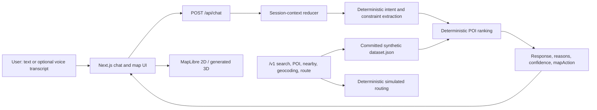

# TASCO Atlas architecture

TASCO Atlas is a camera-free, full-stack hackathon prototype for conversational place discovery and simulated Journey Checkout in Vietnamese. It converts an eligible route request into one explainable, dataset-grounded service bundle, then confirms it locally before the existing 3D presentation payoff.

The prototype deliberately optimizes for a reliable overnight demo: one Next.js application, one committed synthetic dataset, no database, optional grounded OpenAI prose with deterministic fallback, and no claim that prices, receipts, routes, or 3D objects represent live TASCO infrastructure.

## Journey composition and revision

`src/lib/journey.ts` is a pure deterministic commerce layer beside ranking. It accepts organically ranked POIs, attaches eligible fuel/dining/parking actions afterward, and never changes the ranker. Actions use stable hashes, integer VND arithmetic, exact recomputed totals, and visible simulation disclosures. Ordered café → phở requests carry a typed stop category plus an optional strict cuisine/dish constraint beside the legacy dining action kind, so revisions cannot replace a café with a restaurant or a requested phở stop with unrelated food. Each leg is ranked from its own segment plus shared location/constraints. The response carries only the prior query/location, selected POI IDs, action kinds, optional ordered stop categories and index-aligned cuisines, total, and revision number for the next turn.

A cheaper revision searches same-kind, same-city candidates, applies the score-floor utility guardrail, and accepts a replacement only if the complete total is strictly lower. Otherwise it returns `no_cheaper_option` with the unchanged bundle. OpenAI cannot mutate the structured journey. Browser confirmation locks on first activation, creates one session-local simulated VETC receipt, and triggers Route Theater when motion and map readiness permit.

## System shape



The browser owns the presentation and current conversation. The server routes own deterministic interpretation, search, ranking, and response construction. Shared TypeScript types keep the UI, chat API, and `/v1` facade aligned.

`SessionContext.recentQueries` keeps the current user turn plus the three prior user turns. Typed journey state carries ordered stops and strict cuisine/dish enums across refinements; an explicit new category/topic rebases the rolling context so stale café/restaurant or city text cannot leak into the new search. The optional NLU model may translate only supported café/restaurant and cuisine enums, but POI selection, hard dish matching, and ordering remain deterministic.

## Session and context management

`POST /api/chat` accepts the current message plus optional client-supplied context:

- `sessionId`: an opaque client-generated identifier for the current demo session.
- `profileId`: one of the eight synthetic user profiles.
- `location`: optional latitude/longitude used for distance-aware ranking.
- `history`: optional prior user/assistant messages (or a compact history string).
- `sessionContext`: structured state from the prior response.

The response returns a refreshed `sessionContext` containing the intent/query and any reusable constraints or unresolved clarification. The client should pass that value back on the next turn. This makes context explicit and testable instead of hiding it in an LLM prompt or a database.

The current UI also keeps rendered messages in React state and generates a new `sessionId` when the user clears the conversation. There is no account store or durable conversation database. A process restart or browser refresh discards transient state unless a caller has retained and resubmits its own `history`/`sessionContext`.

### Context behavior

1. Normalize Vietnamese text while retaining the original message for the reply.
2. Combine the current message with relevant prior constraints.
3. Infer intent, category, location, attributes, budget, and route/planning cues.
4. Detect ambiguous named entities before choosing a destination. For example, `Galaxy` maps to both `Galaxy Nguyễn Du` and `Galaxy Hotel Đà Nẵng`, so the assistant should return a `clarify` action with candidates.
5. Rank only after the request is sufficiently constrained.
6. Return both human-readable text and a machine-readable `mapAction`.

`mapAction` is the integration boundary for a future TASCO client. Supported action types are `none`, `search`, `show`, `clarify`, `route`, and `plan`; an action may include POI IDs, candidates, a selected POI, a center/zoom, or a route.

## Recommendation methodology

The recommender is a deterministic lexical-and-metadata ranker over the committed POI dataset. It does not call an embedding service, a vector database, or an external LLM.

For each candidate POI, the engine computes:

```text
score = clamp(
  0.040 baseline
  + 0.270 text overlap
  + 0.200 category match
  + 0.130 location match
  + 0.100 attribute/tag match
  + 0.110 profile-preference match
  + 0.070 quality
  + 0.070 distance proximity
  + 0.025 featured-data boost
  + 0.080 budget compatibility
  + avoidance penalty
  + intent-specific boost,
  0, 1
)
```

`quality` is itself a blend of normalized rating and popularity:

```text
quality = 0.55 * (rating / 5) + 0.45 * (popularityScore / 100)
```

Distance uses a Haversine calculation and decays linearly within the requested radius (20 km when no radius is supplied). Profile avoidance applies a negative contribution: a full phrase match is `-0.24`; partial token overlap is up to `-0.15`. Curated intent boosts, capped at `0.45`, make the public evaluation fixtures deterministic for queries such as business meetings, dates, family activities, airports, fuel/toilets, or named places.

The response exposes weighted contributions in `scoreBreakdown`. Ties resolve by higher `popularityScore`, then stable POI ID, so repeated requests return the same order. Recommendation reasons are derived from matched attributes and profile preferences; they are not invented reviews.

### Confidence

Confidence is a response-level estimate, not a probability that a venue is objectively best. For ordinary search/recommendation/planning responses it is computed from the leading recommendation:

```text
confidence = clamp(0.55 + 0.40 * topScore, 0.40, 0.97)
```

Fixed behavior-specific values make public evaluation deterministic: `0.99` means the engine is highly confident that clarification is required; a named-place explanation is `0.96`; navigation is `0.95` with an explicit origin or `0.82` with an inferred origin; identifying a destination while still requiring an origin is `0.80`. A high clarification confidence therefore does not claim that any candidate is correct—it expresses confidence in the decision not to guess.

### Deterministic fallback contract

The deterministic engine is the current implementation and the production-safe fallback seam for a future LLM-enhanced version. If an LLM is added later, it should be limited to language understanding and response phrasing; the same schema, allowlisted map actions, dataset-grounded POIs, and deterministic ranker should remain available when the model, network, or API key is unavailable.

## Search and route facade

The `/v1` endpoints mirror the supplied TASCO hackathon contract for search, autocomplete, POI lookup, reverse geocoding, nearby search, geocoding, and routing. They read the same committed JSON as the chat endpoint, so API demos and UI demos use consistent IDs and coordinates.

`POST /v1/route` is intentionally deterministic and simulated. It interpolates a GeoJSON `LineString` between supplied coordinates, calculates distance with Haversine geometry, and estimates duration using fixed mode speeds. Alternatives are generated with stable offsets. It does not query a road graph, traffic feed, toll system, or the production endpoints named in the supplied Word document.

## 2D, 3D, and Route Theater

Both map modes use the same MapLibre canvas.

- **2D mode:** raster OpenStreetMap base tiles, category-colored POI markers, selected-place details, and route lines.
- **3D mode:** pitched/bearing camera plus generated square `fill-extrusion` towers. Tower height is derived from `popularityScore`; footprints are visualization glyphs, not real building geometry.
- **3D AI Route Theater:** sequences up to four recommended POIs, progressively draws a presentation route, and flies the camera between stops while the UI shows the current reason card.

Route Theater is the non-camera “wow” moment: the assistant visibly turns a conversation into a spatial story. Its connecting line is a demo visualization, not turn-by-turn navigation.

## Voice path

Voice is provider-toggleable speech-in/speech-out with a deterministic scripted/text fallback. ElevenLabs is the default; Valsea (SEA-accent specialist) is the alternative, selected per direction with `TASCO_STT_PROVIDER` and `TASCO_TTS_PROVIDER` (values: `elevenlabs` | `valsea`; unrecognized values fall back to ElevenLabs).

1. The user explicitly presses the session start control before microphone capture begins.
2. The browser calls `POST /api/stt/token`, which returns `{ provider, token }`. For ElevenLabs this is a single-use Scribe token (15-minute expiry, consumed on use) minted with the server-side `ELEVENLABS_API_KEY`. For Valsea — which has no token-minting endpoint — the route returns `VALSEA_API_KEY` itself, because Valsea's documented browser WebSocket auth is `?api_key=`; that trade-off is demo-only and flagged in the route.
3. `stt-client.ts` opens the provider's realtime WebSocket and streams 16kHz PCM16 mic audio. ElevenLabs: Scribe v2 Realtime with `keyterms` biasing and server-side VAD (`vad_threshold` 0.75). Valsea: `valsea-rtt` model with `language: vietnamese` and the same domain vocabulary passed as `hint_text`; audio starts only after `session.ready`.
4. Partial transcripts (`partial_transcript` / `transcript.partial`) drive the live caption and barge-in checks; committed transcripts (`committed_transcript` / `transcript.final`) go through `/api/chat`, so the deterministic ranker and journey engine remain authoritative for POIs, routes, prices, totals, and changes.
5. The grounded `assistantResponse` text is spoken via `POST /api/tts`, a server-side proxy that never generates or alters text. ElevenLabs: Flash v2.5 (`eleven_flash_v2_5`, `ELEVENLABS_VOICE_ID` optional). Valsea: OpenAI-compatible `POST /v1/audio/speech` (`valsea-tts`, `VALSEA_VOICE` optional, default `valsea-neutral`).
6. Barge-in is word-confirmed only (`isConfirmedSpeech` / stricter `isConfirmedBargeIn` during playback) and stops TTS playback immediately.
7. Missing credentials, microphone denial, WebSocket failure, or provider failure preserves the scripted judge path and text composer.

The app does not persist an audio file. Realtime transport is session-only, and ending the Atlas session stops every local media track and closes the WebSocket.

## Privacy boundaries

The prototype's privacy stance is narrow and verifiable:

- No camera, photo, face, or video capture.
- No TASCO/VETC account login, wallet, vehicle, toll, or trip history.
- No database and no durable server-side conversation store.
- Chat responses declare `privacy.persisted: false` and `privacy.mode: session-only`.
- No production TASCO geocode or route endpoint is called.
- No external LLM is required. When configured, OpenAI only rewrites grounded prose with `store:false`; deterministic structured fields remain unchanged.

Important boundary conditions:

- The browser requests raster tiles from OpenStreetMap, so the tile host receives an ordinary network request (including network metadata such as IP address).
- Optional browser speech recognition may involve the browser vendor.
- Callers of the REST API can choose to log requests outside this prototype; that is not part of this repository.
- A future deployment still needs authentication, rate limits, retention rules, consent UX, vendor review, and a data-protection assessment before it can handle real users or location histories.

## Data and live-service caveats

`dataset.xlsx` and its committed JSON conversion are synthetic demo fixtures dated 2026-07-11:

- 80 POIs
- 8 synthetic user profiles
- 8 conversation scenarios
- 30 public evaluation cases

The POIs are useful for deterministic evaluation, not operational truth. They do not establish current hours, prices, crowding, inventory, accessibility, entrances, parking availability, traffic, or real building geometry. Generated lower-tier records may contain deliberately rough combinations suitable only for test coverage.

The Word API document includes production-looking TASCO geocode and route URLs, but this prototype does not verify or call them. All service responses except third-party map tiles are generated from repository fixtures. Any future live adapter must label provenance per result, preserve a deterministic timeout/fallback path, and avoid silently mixing mock and production data.

## Production hardening path

Before integration with a real TASCO app:

1. Replace synthetic POIs with versioned, licensed data and provenance fields.
2. Add authenticated, rate-limited server adapters for approved search and routing services.
3. Validate every map action against an allowlist and coordinate bounds.
4. Store only the minimum context required, with explicit retention and deletion controls.
5. Add evaluation gates for ambiguity, geographic correctness, unsafe destinations, and unsupported claims.
6. Keep mock/live labels visible in API metadata and the UI.

## Decision record

- **Date:** 2026-07-11
- **Status:** active for the hackathon prototype
- **Question:** What can create a map-native wow moment within the overnight deadline without camera/privacy exposure or unavailable 3D assets?
- **Decision:** Use one MapLibre canvas for a practical 2D mode and a generated 3D AI Route Theater; ground all recommendations in the committed synthetic dataset and keep chat/search/routing deterministic and external-service-free.
- **Why:** This directly demonstrates conversation-to-map action, stays runnable without credentials or network-dependent AI, and makes privacy/data limitations visible rather than speculative.
- **Applies to:** UI modes, chat/map action contract, recommendation engine, route visualization, README, demo script, and API provenance.
- **Tradeoff:** The result is less photorealistic and cannot provide road-accurate routing, live crowding, or real buildings.
- **Risk / blast radius:** Viewers may mistake towers or routes for real infrastructure; mitigate with persistent synthetic-data and simulated-route labels.
- **Revisit when:** TASCO approves a privacy model and provides licensed live POIs, production API access, real building/road geometry, or validated 3D assets.
- **Related Edward rules:** inspect real repo/data first; preserve scope boundaries; do not present unsupported or unverified claims as current truth.
- **Related project notes:** `README.md`, `docs/discussion-over-lunch-jul-11.md` (preserved source discussion).
- **Source:** `problem_statement.md`, `api_documentation.docx`, `dataset.xlsx`, and the implemented prototype under `src/`.
